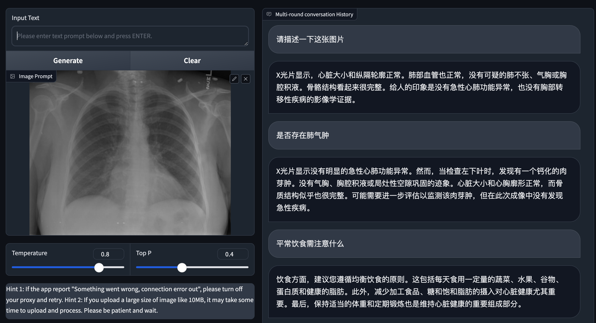
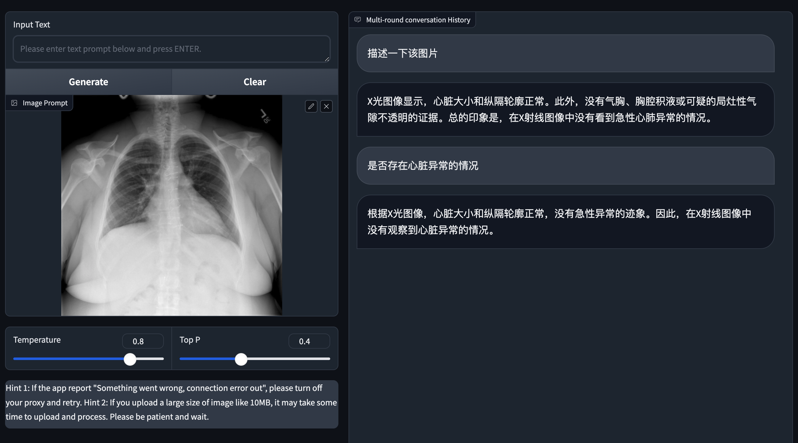

# XrayChat: Chest Radiographs Summarization with Chinese using Vision-Language Models.


## About XrayChat
<hr>

+ XrayChat aims to stimulate research around automated analysis with chinese of chest radiographs based on the given x-ray. 
+ We generate interactive and clean summaries from free-text radiology reports of dataset of [OpenI](https://openi.nlm.nih.gov/faq#collection). These summaries serve to enhance the performance of LLMs through fine-tuning the linear transformation layer on high-quality data.


## Getting Started
### Installation

**1. Prepare the code and the environment**

Clone the repository and create a anaconda environment

```bash
git clone https://github.com/JiangZongKang/XrayChat.git
cd XrayChat
conda create -n intern python=3.9 -y
conda activate intern
pip install -r requirements.txt
```

### Setup

**1. Prepare the Datasets for training**

Download the preprocessed annoatations [openi](https://openi.nlm.nih.gov/faq#collection). we generate Chinese-version Xray-Report paired data from free-text radiology reports of OpenI dataset with the help of chatGPT.

To prepare your finetuning data, you should (1) formulate each sample as a dictionary consisting of an id, an image path list with multiple images, and a list of conversations, and (2) save data samples in JSON files.

For the vision-language example with images, you are required to define placeholder <ImageHere> to define the position to insert the image embeddings.

##### vision-language example (vl_data.json) with 2 samples.

```
  [
    {
      "id": "0",
      "image": ['path/to/image_0.jpg']
      "conversations": [
        {
          "from": "user",
          "value": "<ImageHere> 图中是什么"
        },
        {
          "from": "assistant",
          "value": "这张图中包含了......"
        }
      ]
    },
    {
      "id": "1",
      "image": ['path/to/image_1.jpg']
      "conversations": [
        {
          "from": "user",
          "value": "<ImageHere> what is the color of the dog"
        },
        {
          "from": "assistant",
          "value": "it is ...."
        }
      ]
    }
  ]
```

After pre-pareing the JSON files, you are required to define all the JSON file paths in a text file (e.g., `XrayChat/data.txt`) using the format:

```
<json path> <sample number (k)>
```

For example:

```
path/to/vl_data.json 10
```

This means the model will sample 10k samples from `vl_data.json` per finetuning epoch. The sample counts will be automatically adjusted (either up-sampled or down-sampled) to meet the specified quantities.


**2. Prepare the pretrained InternLM-XComposer2 weights**

We built XrayChat on the v2 versoin of InternLM-XComposer-VL.
Download the InternLM-XComposer2-VL weights from [InternLM-XComposer2-VL_weights](https://huggingface.co/internlm/internlm-xcomposer2-vl-7b)

Then, set the path to the InternLM-XComposer2-VL weight in the finetune_lora config file "XrayChat/finetune_lora.sh" at Line 6.

## Training of XrayChat

**openi finetuning stage**

In the this stage, we use a small high quality image-text pair openi dataset preprocessed by us.

Run the following command. In our experiments, we use RTX 3090 GPU.

```bash
sh finetune_lora.sh
```

### Launching Demo on local machine

Download the pretrained XrayChat checkpoints. [link](https://openxlab.org.cn/models/detail/zongkang/XrayChat)

Try gradio [web_demo.py](web_demo.py) on your local machine with following

```
python web_demo.py --from_pretrained your/XrayChat/checkpoints/path
```

## Examples
  |   |   |
:-------------------------:|:-------------------------:
 |  


## Acknowledgement
<hr>

+ [XrayGPT](https://github.com/mbzuai-oryx/XrayGPT)  
+ [InternLM-XComposer2](https://github.com/InternLM/InternLM-XComposer) 


## License
This repository is licensed under CC BY-NC-SA. Please refer to the license terms [here](https://creativecommons.org/licenses/by-nc-sa/4.0/).